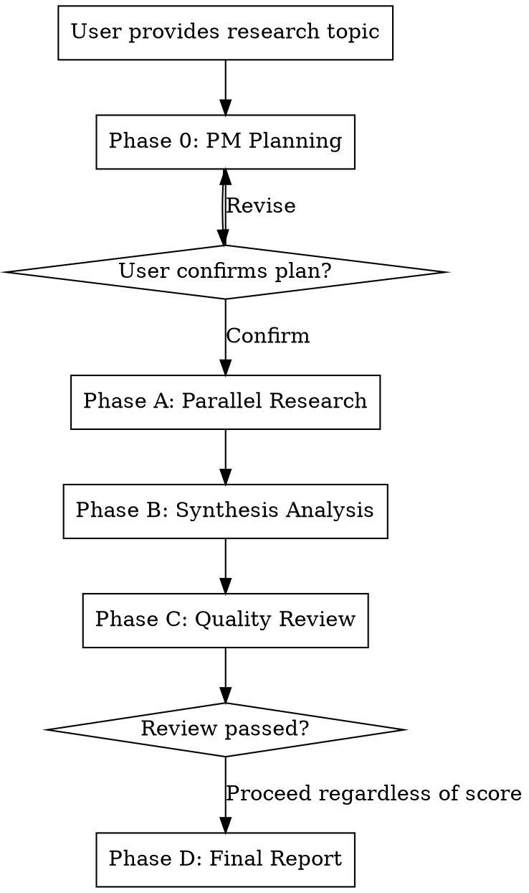

# Deep Research Team

> Deploy a team of specialized AI research agents that work in parallel, cross-validate findings, and deliver publication-ready reports — all inside your coding environment.

## Overview

This skill orchestrates multiple AI agents as a research team: a PM plans the research architecture, specialized agents investigate in parallel, a synthesis agent finds cross-domain patterns and contradictions, a review agent audits quality, and a final agent assembles the deliverable.

**Announcement:** "I am using the deep-research-team skill to conduct deep research."

**Core Architecture:**
```
User (defines research topic)
  └─ Orchestrator (PM role)
       ├─ Phase A: N research agents in parallel
       ├─ Phase B: Synthesis agent (cross-validation)
       ├─ Phase C: Review agent (quality audit)
       └─ Phase D: Final report assembly
```

**Agent Communication Mechanism:** File system relay. Each agent writes its output to a designated path; the orchestrator reads the output and assembles it into the downstream agent's prompt. Agents do not communicate directly with each other.

## Research Modes

The user may choose between two modes:

| Mode | Number of Agents | Flow | Best For | Estimated Time |
|------|-----------------|------|----------|----------------|
| **Quick** | 3 research + 1 synthesis = 4 | Phase 0 → A → direct report | Quick topic overview, initial investigation | 5–10 minutes |
| **Full** | 3–10 research + 3 post-processing = 6–13 | Phase 0 → A → B → C → D | Deep due diligence, investment research, competitive analysis | 15–30 minutes |

**Default:** If the user does not specify a mode, select automatically based on depth requirement:
- Overview → Quick
- Professional / Academic → Full

---

## Quick Mode Flow

Quick Mode executes only Phase 0 + Phase A, then the orchestrator directly aggregates and produces a summary report.

1. **Phase 0**: PM planning (fixed 3 research agents, 3 core questions each, 800–1500 words)
2. **Phase A**: 3 research agents run in parallel (model: sonnet)
3. **Orchestrator aggregation**: Reads 3 research.md files and directly produces:
   - `final_report/executive_summary.md` (summary within 1000 words)
   - Does not produce full_report.md (user can read each module's research.md directly)

Quick Mode **skips** Phase B (Synthesis), Phase C (Review), and Phase D (Final Report), significantly reducing token consumption.

---

## Full Mode Execution Flow



## Phase 0: PM Planning

### Step 1: Gather Research Requirements

Confirm the following information with the user (ask at most 3 questions):

| Dimension | Description | Required? |
|-----------|-------------|-----------|
| **Research Topic** | The core question to investigate | Required |
| **Research Goal** | Expected output (report, comparison, trend forecast, etc.) | Required |
| **Depth Requirement** | Overview / Professional / Academic | Required |
| **Focus Areas** | Aspects to pay special attention to | Optional |
| **Exclusions** | Content that does not need to be covered | Optional |
| **Language Preference** | Report language (Default: English) | Optional |

### Step 2: Design the Research Plan

Using the `./prompts/pm-planner-prompt.md` template, produce a planning document that includes:

1. **Research Architecture Overview** — One paragraph + agent assignment table
2. **Directory Structure** — Complete file directory tree
3. **Agent Definitions** — 7-field definition for each agent (see template)
4. **Execution Order** — Dependency relationships for Phase A → B → C → D
5. **Synthesis Instructions** — Specific tasks for the synthesis analysis
6. **Review Instructions** — Specific quality-check criteria

### Step 3: User Confirmation

Present the planning document to the user and wait for confirmation or revision.
- Confirmed → Proceed to Phase A
- Revision requested → Adjust and re-present

### Step 4: Create Directory Structure

Based on the planning document, create all folders under the working directory.

## Phase A: Parallel Research

### Dispatch Rules

1. Read the `./prompts/research-agent-prompt.md` template
2. Assemble an independent prompt for each research agent (fill in template variables)
3. **All research agents MUST be dispatched in parallel in the same round** (multiple agent tool calls in a single message)
4. Each agent uses `run_in_background: true` to run in the background
5. Wait for all agents to complete

### Agent Prompt Assembly

Each research agent's prompt MUST include:
- Role definition (copied from the planning document)
- List of core questions (3–5 specific questions)
- Data source guidance (what types of sources to look for)
- Output specifications (format, word count, required sections)
- Output path (exact file path)
- Quality standards (facts must include sources; data must include timestamps)

### Output Validation

After each agent completes, the orchestrator checks:
- [ ] File has been written to the designated path
- [ ] sources.md is included
- [ ] Word count meets the requirement
- [ ] All core questions have been answered

If any agent's output is non-compliant, re-dispatch that agent (does not affect other completed agents).

## Phase B: Synthesis Analysis

1. Read all research agents' output files
2. Read the `./prompts/synthesis-agent-prompt.md` template
3. List all output **file paths** in the Synthesis Agent's prompt
4. Dispatch the Synthesis Agent (foreground execution; wait for result)
5. The Synthesis Agent reads all research outputs and produces a synthesis analysis

## Phase C: Quality Review

1. Read the `./prompts/review-agent-prompt.md` template
2. List the synthesis analysis + all research output paths in the Review Agent's prompt
3. Dispatch the Review Agent
4. The Review Agent produces a review report including a quality score (1–10)

**Score Handling:**
- ≥ 6 → Proceed to Phase D
- < 6 → Proceed directly to Phase D with the review report; the Final Report Agent notes the issues in the "Research Limitations" section
- Do not re-run Phase B–C (avoid wasting tokens; incorporate the review recommendations into the Final Report instead)

## Phase D: Final Report

1. Read the `./prompts/final-report-agent-prompt.md` template
2. List the synthesis analysis + review report paths in the prompt
3. Dispatch the Final Report Agent to produce:
   - `final_report/full_report.md` — Complete report
   - `final_report/executive_summary.md` — Summary (within 1000 words)
4. Present the summary to the user and inform them of the full report path

## Completion Criteria

- [ ] research.md and sources.md produced for all research modules
- [ ] Synthesis analysis completed
- [ ] Review report produced (including score)
- [ ] Final report and summary produced
- [ ] Summary and report path presented to the user

## Model Selection

| Role | Recommended Model | Reason |
|------|------------------|--------|
| Research Agent | sonnet | Balances speed and quality; cost-efficient when run in parallel |
| Synthesis Agent | sonnet | Aggregation work is well-structured; sonnet is sufficient |
| Review Agent | opus | Requires critical thinking and quality gatekeeping |
| Final Report Agent | sonnet | Integration and writing work; sonnet quality is adequate |

## Prompt Templates

All templates are stored in the `./prompts/` directory:

| Template | Purpose |
|----------|---------|
| `pm-planner-prompt.md` | PM planning phase — design the research plan |
| `research-agent-prompt.md` | General-purpose template for research agents |
| `synthesis-agent-prompt.md` | Synthesis analysis agent |
| `review-agent-prompt.md` | Quality review agent |
| `final-report-agent-prompt.md` | Final report agent |

## Important Notes

**NEVER:**
- Create dependencies between research agents (they MUST be parallelizable)
- Skip the Review phase and produce the final report directly
- Overload a single agent with too many research topics (more than 5 core questions)
- Omit sources.md (every fact MUST have a source)

**ALWAYS:**
- Wait for user confirmation before executing the planning phase
- Dispatch all research agents in parallel
- Make each agent prompt self-contained (not dependent on other agents' outputs)
- Maintain a consistent and traceable directory structure
